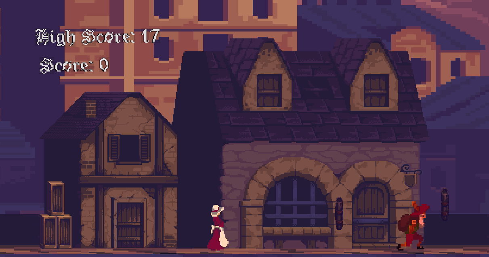

<a name="readme-top"></a>


<!-- TABLE OF CONTENTS -->
<details>
  <summary>Table of Contents</summary>
  <ol>
    <li>
      <a href="#about-the-project">About The Project</a>
      <ul>
        <li><a href="#built-with">Built With</a></li>
      </ul>
    </li>
    <li>
      <a href="#getting-started">Getting Started</a>
      <ul>
        <li><a href="#prerequisites">Prerequisites</a></li>
        <li><a href="#installation">Installation</a></li>
      </ul>
    <li><a href="#roadmap">Roadmap</a></li>
    <li><a href="#contributing">Contributing</a></li>
    </li>
       

  

  </ol>
</details>


<h1 align="center">2D Platform Game</h1>

My project for Game Development made with Unity game engine. This game focuses on the fundamental of game developement. 

_____________________________________________________________________________________________________

<!-- ABOUT THE PROJECT -->
## About The Project





This is for performing CRUD operations in relation to managing students in a given organization. Currently the main focus of the project is to build a RESTful API with JWT. Addition of front-end will began soon, along with the integration of all API functions.

Features:
* Scoring 
* Asset animations
* Cohesive game design


<p align="right">(<a href="#readme-top">back to top</a>)</p>


### Built With


* [![C#][C#]][C#-url]
* [![Unity][Unity]][Unity-url]

<p align="right">(<a href="#readme-top">back to top</a>)</p>


<!-- GETTING STARTED -->
## Getting Started

Download all the prerequisites below in order.

### Prerequisites
Download all of these to get started

* [Unity](https://unity.com)


### Installation

_Once installed, open a command prompt, choose your directory wherein you want to save the project. Finally, clone the repo._


1. Clone the repo
   ```sh
   C:\Users\PC> git clone https://github.com/neekho/2DUnity.git
   ```
2. Open the project using Unity Hub
   ```sh
   C:\Users\PC>  <Browse Project Location>


<p align="right">(<a href="#readme-top">back to top</a>)</p>

___________________________________________________________________________________________________


<!-- ROADMAP -->
## Roadmap

- [ ] Add crouch functionality 

- [ ] Create range attack for main character


<p align="right">(<a href="#readme-top">back to top</a>)</p>

___________________________________________________________________________________________________

<!-- CONTRIBUTING -->
## Contributing

Contributions are what make the open source community such an amazing place to learn, and create. Any contributions you make are **greatly appreciated**.

If you have a suggestion that would make this better, please fork the repo and create a pull request. You can also simply open an issue with the tag "enhancement".
Don't forget to give the project a star! Thanks again!

1. Fork the Project
2. Create your Feature Branch (`git checkout -b feature/AmazingFeature`)
3. Commit your Changes (`git commit -m 'Add some AmazingFeature'`)
4. Push to the Branch (`git push origin feature/AmazingFeature`)
5. Open a Pull Request

<p align="right">(<a href="#readme-top">back to top</a>)</p>


<!-- MARKDOWN LINKS & IMAGES -->
<!-- https://www.markdownguide.org/basic-syntax/#reference-style-links -->
[product-screenshot]: https://i.ibb.co/znW0GNN/Caputre-1.png" alt="Caputre-1

[C#]: https://img.shields.io/badge/CSharp-35495E?style=for-the-badge&logo=csharp&logoColor=white
[C#-url]: https://learn.microsoft.com/en-us/dotnet/csharp/tour-of-csharp/


[Unity]: https://img.shields.io/badge/Unity-202020?style=for-the-badge&logo=unity&logoColor=white
[Unity-url]: https://unity.com


